<style type='text/css'>
  [class*="red"] { color: red; }
  [class*="green"] {color: green; }
  [class*="yellow"] {color: yellow; }
  
</style>

<!-- <h3 class="red">Request</h3>

```json

Headers
{
}

```

<h3 class="red">Request</h3>

```ts
client.emit('', data);
``` -->

# client Events

## handleConnection

- client에 userDto 가지고 다님
- status를 확인해서 offline아닌데 재접속인 경우는 본인인지 확신할 수 없는 소켓이 접속한 것이므로 에러 던짐.
- status는 ['online', 'offline', 'inGame'] 3개로만 구분 됨

<h3 class="red">Request</h3>

```json
// Headers
{
  "access_token": "발급 받은 Access Token"
}
```

<h3 class="green">Response</h3>

```ts
client.emit('single:user:connected', data);

data {
  me: {
    userId: 1,
    username: 'seonkim',
    status: 'online',
    follows: [2, 3],
    blocks: []
  },
  users: [
    {
      userId: 2,
      username: 'gilee',
      status: 'online',
    },
    {
      userId: 3,
      username: 'taeskim',
      status: 'inGame',
    },
    ...
  ],
  channels: [
    {
      adminId: 3,
      channelIdx: 1,
      accessLayer: 'public',
      channelName: 'taeskim과 신나는 게임 한판',
      score: 11,
      onGame: true
    },
    ...
  ]
}

client.broadcast.emit('broad:user:connected', data);

data: {
  userId: 1,
  username: 'seonkim',
  status: 'online'
}

```

<br>

<h3 class="yellow">Exception</h3>

- [Exception-1](#exception-1) JWT 인증 실패 (만료, 비정상 토큰 등)
- [Exception-2](#exception-2) 이미 접속중인데 추가로 접속하는 경우 (보안 강화 목적)
- [Exception-3](#exception-3) clientException일 경우
<br>

### Sequence Diagram

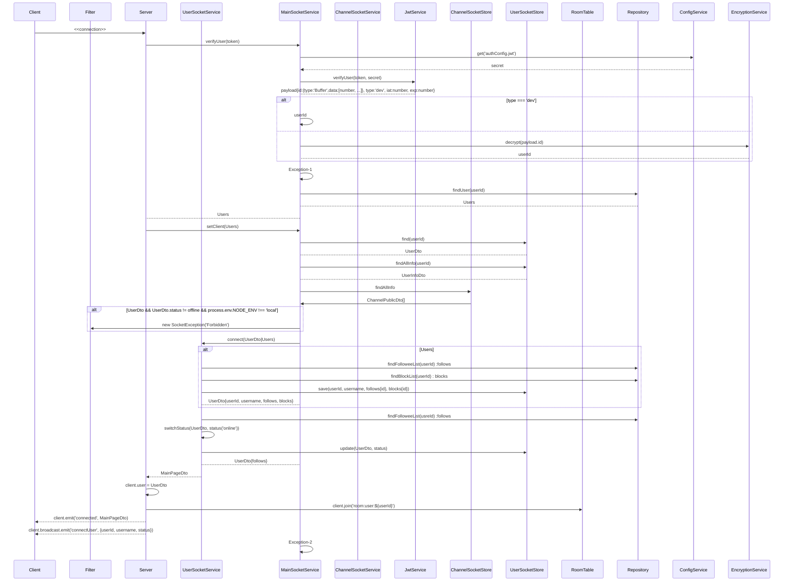

<br>

## handleDisconnect

<br>

<h3 class="green">Response</h3>

```ts
client.broadcast.emit('broad:user:disconnected', data);

data: {
  userId: 1,
  status: 'offline'
}
```

<br>

### Sequence Diagram

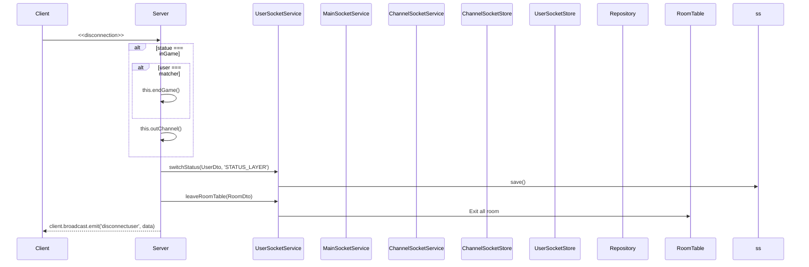

<br>

# inChannel

- channelName pattern; room:channel:channelID

## inChannel (listen)

```
{userId:'121', userName:'mtak', status:"inGame", channelId:"diavlo"}
```

## getChannelInfo (listen)

```
{channelName:"diavlo",  accessLayer: "private",
  score: 13, adminID: 543}
```

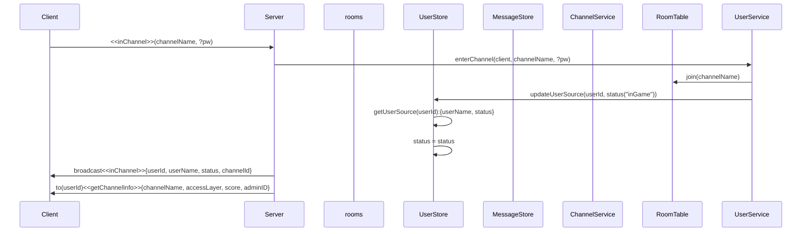

# outChannel

- 이벤트 던지는 상황
- 정상적으로 나가기 버튼을 눌렀을 때
- 새로고침이나 뒤로가기로 나갔을 땐(커넥션 끊겼을 땐?)
- connection, disconnection이벤트에서 status 관라

## outChannel (listen)

```
{userId:412}
```

## outWaitList (listen)

```
{userId:1234}
```

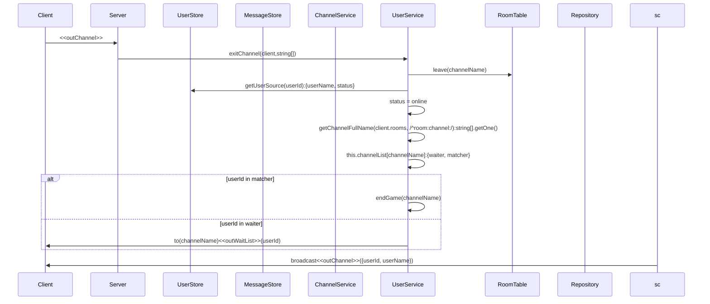

# block

- 상대의 DM을 안받는다. => 모든 DM은 pass된다. 대신 초기 connection에서 DB를 뒤져 blocklist를 local storage로 내려준다. client는 일단 DM을 받고 localStorage를 뒤져서 있으면 뿌려주고 없으면 무시한다.
- unfollow처리한다.
- local에서 friends, blocks 데이터 내려줘야됨.

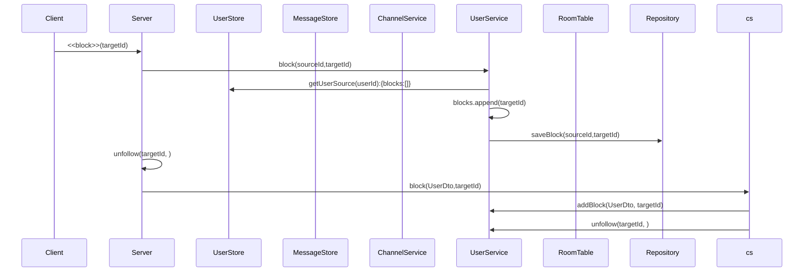

# follow

## friendChanged (listen)

```
{userId: 431, targetId:4123, isFriend:true}
```

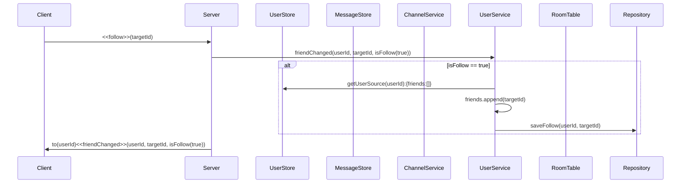

# unfollow

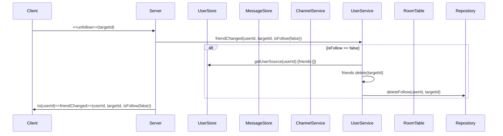

# sendDM

## getDM (listen)

```
{userId:'121', userName:'mtak', msg:'hihi'}
```

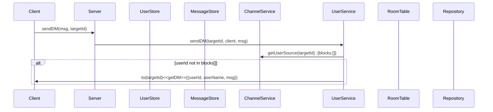

# sendMSG

- channel단위 msg 전송

## getMSG (listen)

```
{userId:'121', userName:'mtak', msg:'hihi'}
```

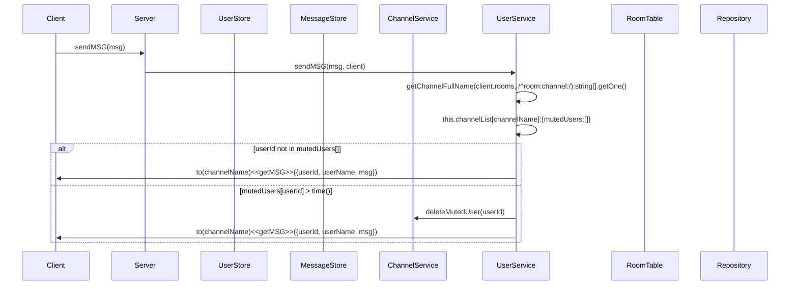

# kickOut

## expelled (listen)

```
'you are expelled from helloPython'
```

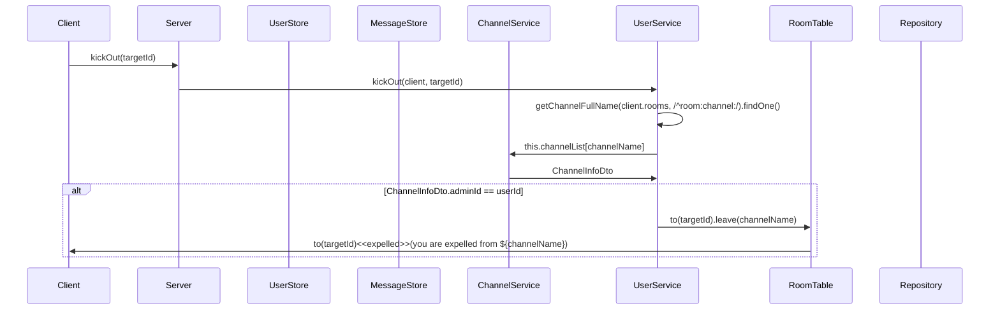

# modifyGame

- ChannelInfoDto

```
export interface ChannelDisplayableDto {
  accessLayer: ACCESS_LAYER;
  channelName: string;
  score: number;
  adminID: number;
}

export interface MutedUser {
  expiredDate: number;
  userID: number;
}

export interface Matcher {
  userID: number;
  isReady: boolean;
  score: number;
}

// export interface Game {}
export interface ChannelInfoDto {
  password?: string; // todo: bcrypt
  channel: ChannelDisplayableDto;
  waiter: Array<number>;
  kickedOutUsers: Array<number>;
  mutedUsers: Array<MutedUser>;
  matcher: Array<Matcher>;
  onGame: boolean;
}
```

## gameModified (listen)

```
{channelName:'helloPython', accessLayer:'public', score:'12', adminId:'121'}
```

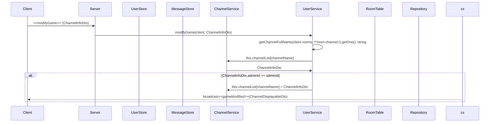

# inviteUser

- 게임중인 놈은 초대할 수 없음.
- 현재 내가 있는 채널로 초대한다.
- 차단당했으면 초대 메일 안감.

## getInvitation (listen)

```
{inviter:'121'}
```

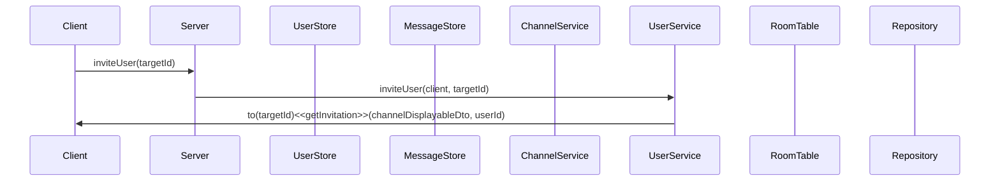

# mute

- 방장만mute를 시킬 수 있다

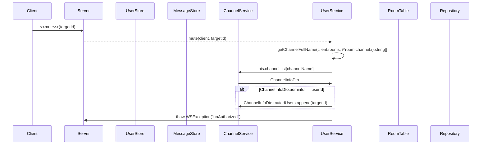

# waitingGame

## getWaitingList (listen)

```
{userId:'121', userName:'mtak'}
```

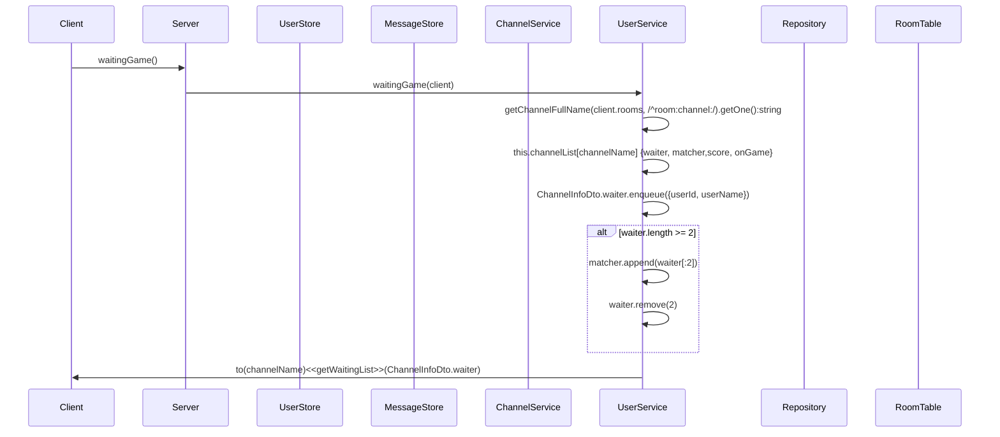

# readyGame

- first server는 첫번째 waiter이다.

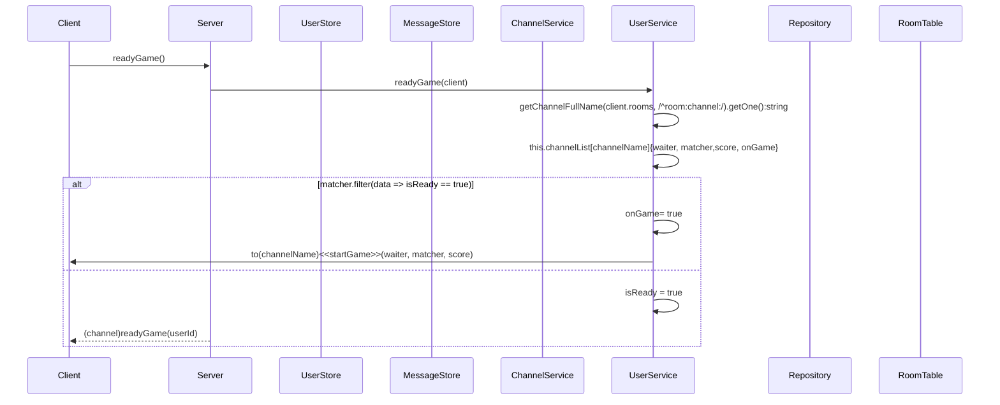

# generateChannel

- private(target에게 초대 메시지 알림 감), protected(pw있어야 함)

## createChannel (listen)

```
{channelName:"diavlo",  accessLayer: "private",
  score: 13, adminID: 543}
```

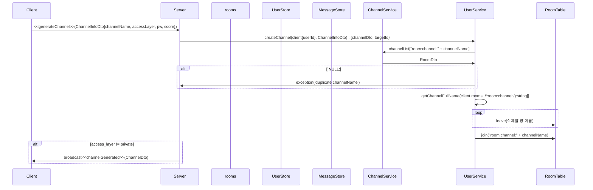

# endGame

- 게임 기록 db에 등록
- matcher 제거
- 대기열 유저 matcher 등록
- 등록된 유저 대기열 삭제
- channel에 게임 종료 emit{matcher, waiter}

## gameOver (listen)

```
{matcher:[1234, 45315], waiter:[5234, 34542, 3425342]}
```

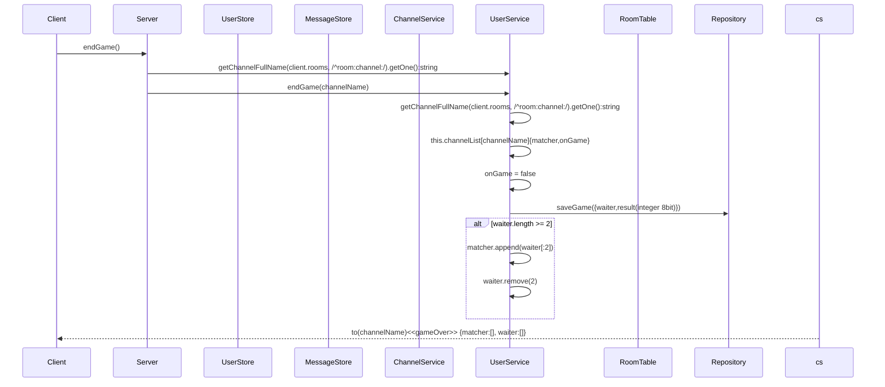

# castPingPong

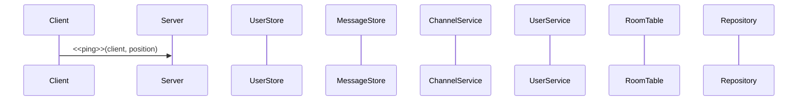

# Exceptions

## Exception-1

> JWT 인증 실패

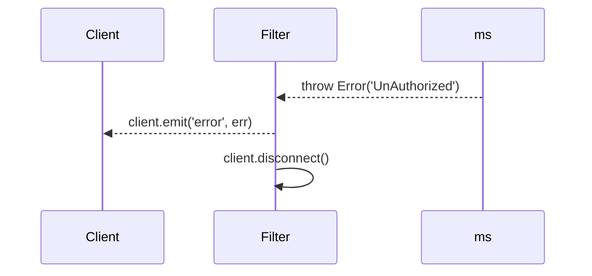

<br>

## Exception-2

> HttpException과 동일함


## Exception-3

> clientException

```mermaid
sequenceDiagram
participant c as Client
participant f as Filter

participant ga as Gateway

ga->>f: throw clientException()
ga-->c: client.emit('single:user:error', {
          error: 'server',
          message: 'unKnown',
        })
ga->c: client.disconnect()
```