# 모든 소켓 통신
- auth.sessionId 서버 저장소를 뒤지든 랜덤으로 만들고, userId는 안받으면 에러.
- 이 정보들 서버측에서 socket.*로 쓸 수 있게 값 넣어줌 
#- sessionId: (public용)reconnection시 sessionId로 userId(다른 기기로 접속한 mtak들의 소켓이 userId가 이름인 방 안에 계심.) 찾음.(한번 왔던 놈인지 확인)
- userId: (private용)db의 userId와 동일하며, 무슨 sessionId로 접속하더라도 동일한 자기 room(방이름이 "userId")에 접속할 수 있다. 고로
- 여러 내가 sessionId로 동시 접속시 userId방에 내 소켓이 여러개일 수 있다. 
## afterInit 
---

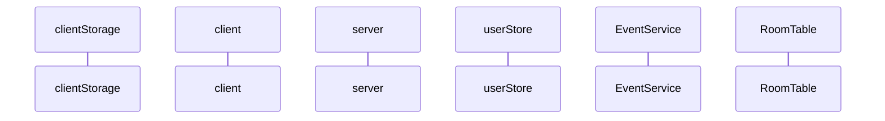

# 소켓 연결 직후
- 영속성을 위해 세션을 저장해준다.
- blockList clienthttp 화면랜더링에서 내려준다.
- 메시지 수령자가 오프라인이면 애초에 보내는 사람이 메시지를 보낼 수 없게 한다. 
--------------------------------
- getBlockList
```
['1234134', '54324532', '324523453']
```
- userEnter
```
{userId:'432425', userName:'mtak', connected:true}
``` 
- getPreLogs
```
[[{userId:'121', userName:'mtak', connected:true, message:[msg:'전화받으셈', from:'111', to:'121']}, {userId:'121', userName:'mtak', connected:true, message:[msg:'어디세요엠탁님', from:'111', to:'121']}], 
[{userId:'121', userName:'mtak', connected:true, message:[msg:'늦게가욤', from:'222', to:'121']}, {userId:'121', userName:'mtak', connected:true, message:[msg:'집현전으로 가겠습니당', from:'222', to:'121']}], ...
]
```
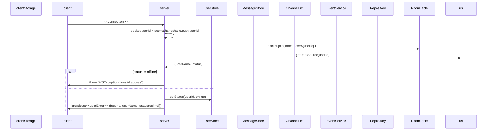

# 소켓 연결 끊겼을 때
- userExit
```
'121'
```
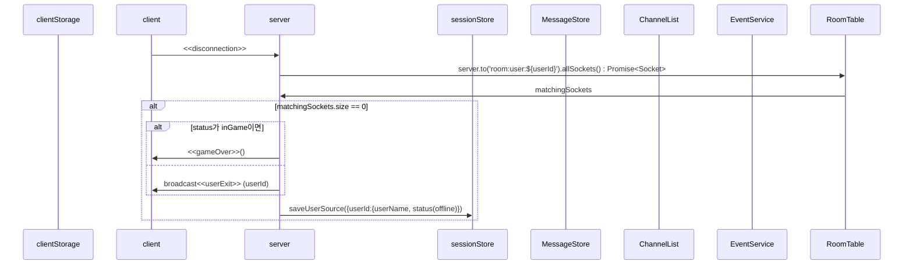

# inChannel
- channelName pattern; room:channel:channelID
- 
```
{userId:'121', userName:'mtak'}
```
- getMessage
```
'mtak님이 입장하셨습니다'
```
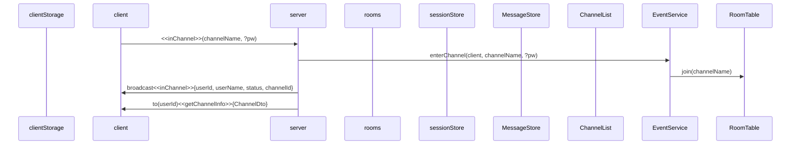

# outChannel
- outChannel
```
'121'
```
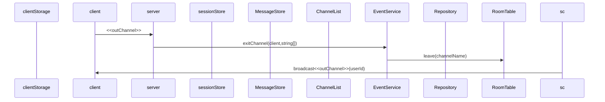

# block
- 상대의 DM을 안받는다. => 모든 DM은 pass된다. 대신 초기 connection에서 DB를 뒤져 blocklist를 local storage로 내려준다. client는 일단 DM을 받고 localStorage를 뒤져서 있으면 뿌려주고 없으면 무시한다.
- unfollow처리한다.
- local
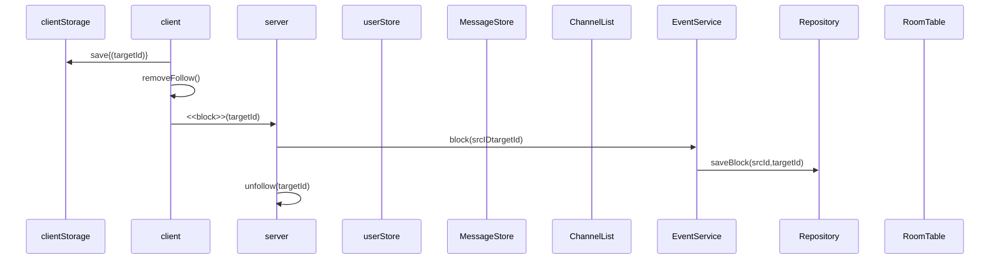
# follow
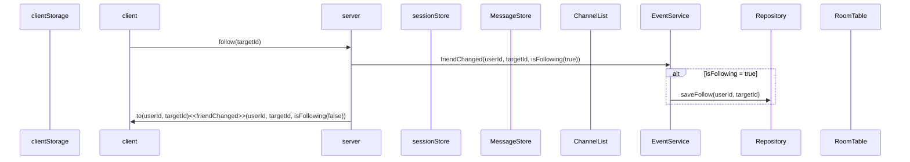
# unfollow
- friendChanged
```
{userId:'121', targetId:'111', isFollowing:false}
```
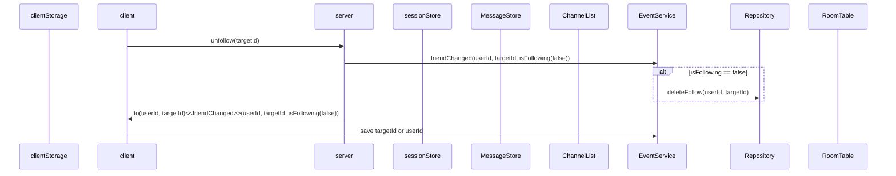

# sendDM
- getDM
```
{userId:'121', userName:'mtak', msg:'hihi'}
```
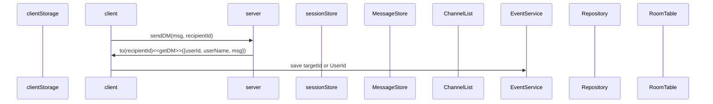

# sendMSG
- channel단위 msg 전송
- getMSG
```
{userId:'121', userName:'mtak', msg:'hihi'}
```
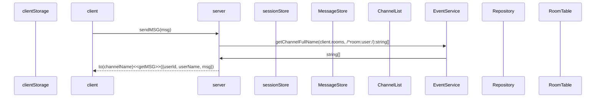

# kickOut
- expelled
```
'you are expelled from helloPython'
```
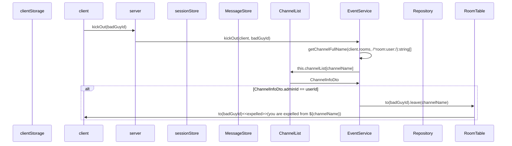
# modifyGame
- gameModified
```
{channelName:'helloPython', accessLayer:'public', score:'12', adminId:'121'}
```

# inviteUser
- ChannelName은 room:user:[userId]
- 게임중인 놈은 초대할 수 없음.  
- getInvitation
```
{inviter:'121', msg:'you are invited to mtak'}
```
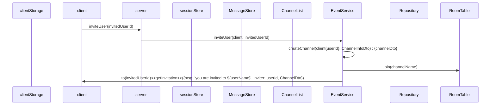

# mute
- mute
```
(아무것도 안줌)
```
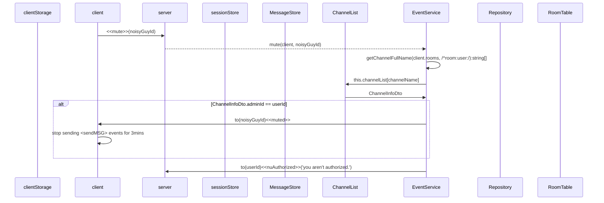
# waitingGame
- getWaitingList
```
{userId:'121', userName:'mtak'}
```
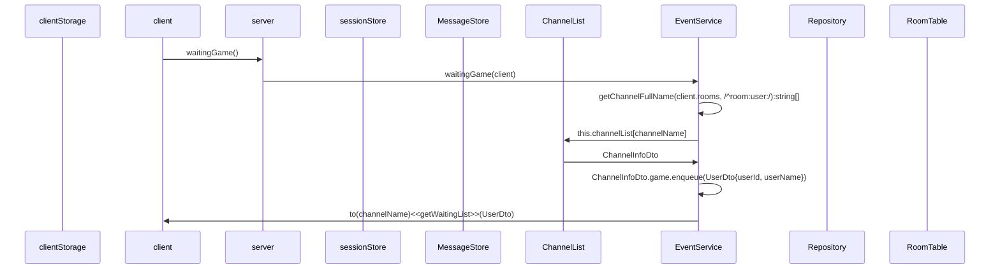
# startGame
- 계속 Queue를 확인하면서 2명인지 체크해야 함.

# readyGame
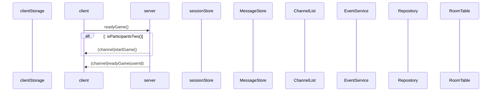
# endGame
- 게임 기록 db에 등록
- matcher 제거
- 대기열 유저 matcher 등록
- 등록된 유저 대기열 삭제
- channel에 게임 종료 emit{matcher, waiter}
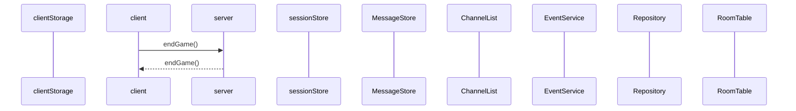
# gameGenerated
- private(target에게 초대 메시지 알림 감), protected(pw있어야 함)
- createChannel
```

```
```mermaid
sequenceDiagram
participant cls as clientStorage
participant c as client
participant ga as server
participant r as rooms
participant ss as sessionStore
participant ms as MessageStore
participant cns as ChannelList
participant cs as EventService
participant rt as RoomTable

c->>ga: <<generateGame>>(ChannelInfoDto{channelName, accessLayer, pw, score, targetId})
ga->>cs: createChannel(client{userId}, ChannelInfoDto) : {channelDto, targetId}
cs->>cns: channelList["room:channel:" + channelName]
cns->>cs: RoomDto
alt !NULL:
cs->> ga: exception('duplicate channelName');
end
cs->>cns: {channelName: RoomDto}
cs->>cs: getChannelFullName(client.rooms, /^room:user:/):string[]
loop
cs->>rt: leave(삭제할 방 이름)
end
cs->>rt: join(channelName)
alt access_layer != private
ga->>c: (broadcast)<<gameGenerated>>(ChannelDto)
```