# 모든 소켓 통신
- afterInit 
- 서버 시작시 한번 실행됨.
- server.use()에 module달려고 했는데 소켓 요청시 해당 모듈을 안지남. (왜지..?)

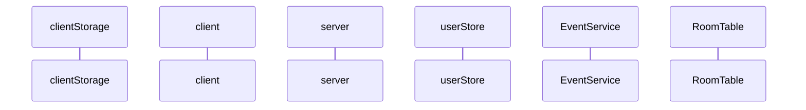

# 소켓 연결 직후
- socket에 userId 가지고 다님.
- userId가 같은 소켓은 모두 'room:user:${userId}' room에 들어감.
- status를 확인해서 offline아닌데 재접속인 경우는 본인인지 확신할 수 없는 소켓이 접속한 것이므로 에러 던짐.
## userEnter (listen)
```
{userId:'432425', userName:'mtak', connected:true}
``` 
```mermaid
sequenceDiagram
participant cls as clientStorage
participant c as client
participant ga as server
participant cs as EventService
participant ss as userStore
participant ms as MessageStore
participant cns as ChannelList
participant rt as RoomTable
participant rep as Repository

c->>ga: <<connection>>
ga->>ga: socket.userId = socket.handshake.auth.userId
ga->>rt: socket.join('room:user:${userId}')
ga->>ss: getUserSource(userId)
ss-->>ga: {userName, status}
alt status != offline
ga->>c: throw WSException("invalid access")
else
ga->>ga: socket.userName = userName
ga->>ss:setStatus(userId, "online")
ga->>c: broadcast<<userEnter>> ({userId, userName, status("online")})
end
```

# 소켓 연결 끊겼을 때
## userExit (listen)
```
{userId: 121}
```
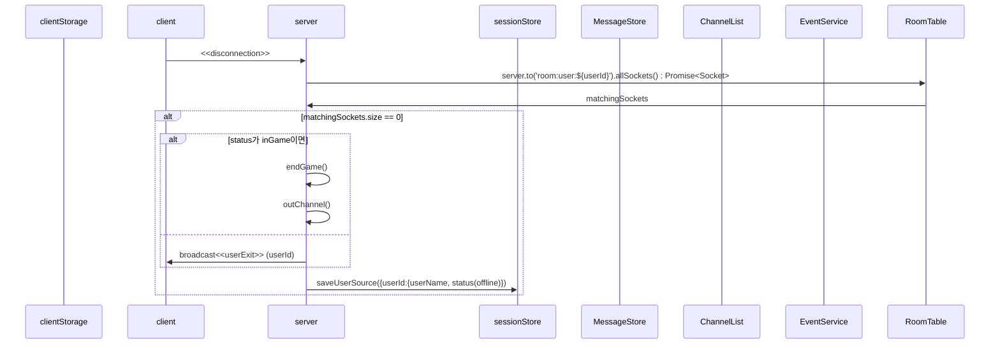

# inChannel
- channelName pattern; room:channel:channelID
## inChannel (listen)
```
{userId:'121', userName:'mtak', status:"inGame", channelId:"diavlo"}
```
## getChannelInfo (listen)
```
{channelName:"diavlo",  accessLayer: "private", 
  score: 13, adminID: 543}
```
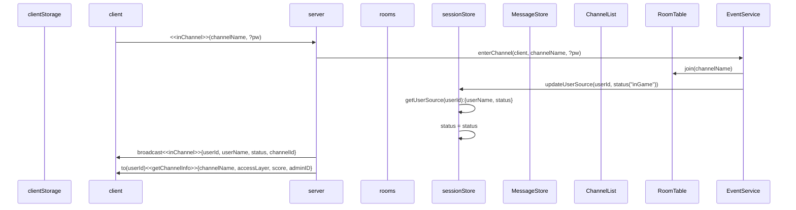

# outChannel
- 이벤트 던지는 상황
- 정상적으로 나가기 버튼을 눌렀을 때
- 새로고침이나 뒤로가기로 나갔을 땐(커넥션 끊겼을 땐?)
- connection, disconnection이벤트에서 status 관라
## outChannel (listen)
```
{userId:412}
```
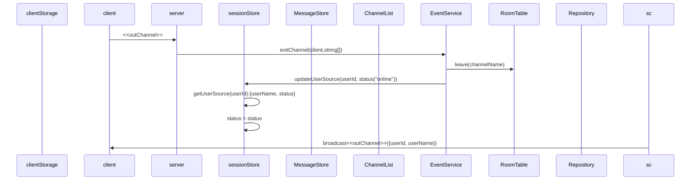

# block
- 상대의 DM을 안받는다. => 모든 DM은 pass된다. 대신 초기 connection에서 DB를 뒤져 blocklist를 local storage로 내려준다. client는 일단 DM을 받고 localStorage를 뒤져서 있으면 뿌려주고 없으면 무시한다.
- unfollow처리한다.
- local에서 friends, blocks 데이터 내려줘야됨.

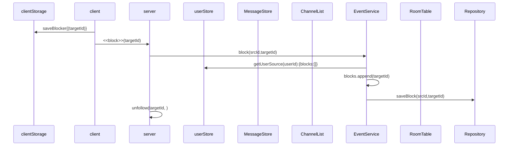
# follow
## friendChanged (listen)
```
{userId: 431, targetId:4123, isFriend:true}
```
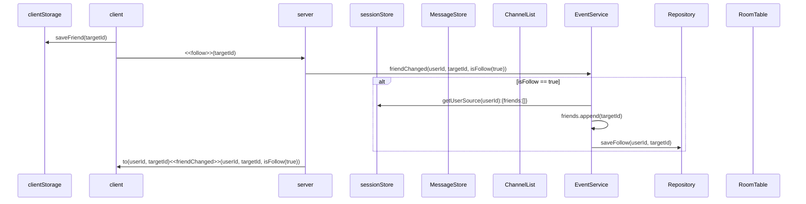
# unfollow
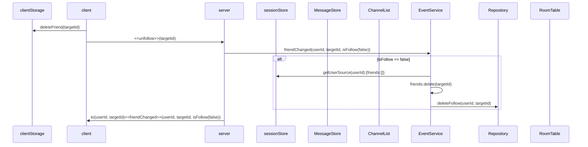

# sendDM
## getDM (listen)
```
{userId:'121', userName:'mtak', msg:'hihi'}
```
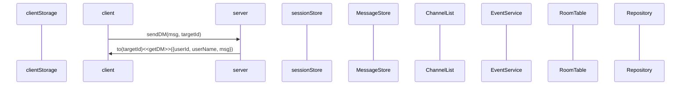

# sendMSG
- channel단위 msg 전송
## getMSG (listen)
```
{userId:'121', userName:'mtak', msg:'hihi'}
```


# kickOut
## expelled (listen)
```
'you are expelled from helloPython'
```
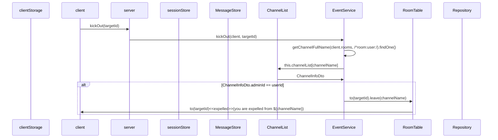
# modifyGame
## gameModified (listen)
```
{channelName:'helloPython', accessLayer:'public', score:'12', adminId:'121'}
```
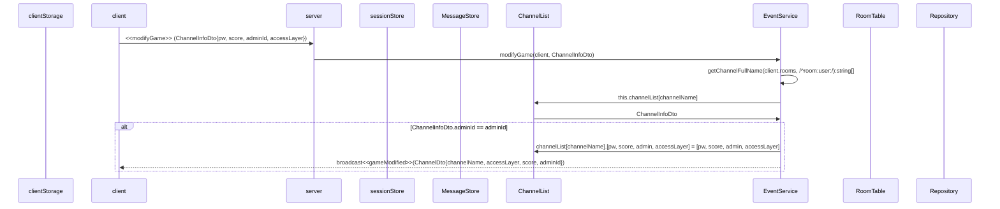
# inviteUser
- ChannelName은 room:user:[userId]
- 게임중인 놈은 초대할 수 없음.  
## getInvitation (listen)
```
{inviter:'121'}
```
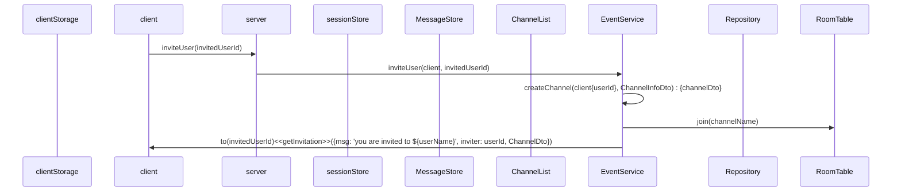

# mute
- mute
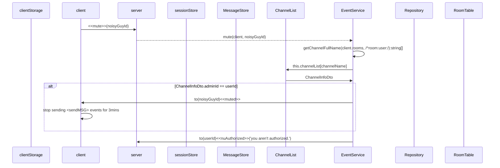
# waitingGame
## getWaitingList (listen)
```
{userId:'121', userName:'mtak'}
```
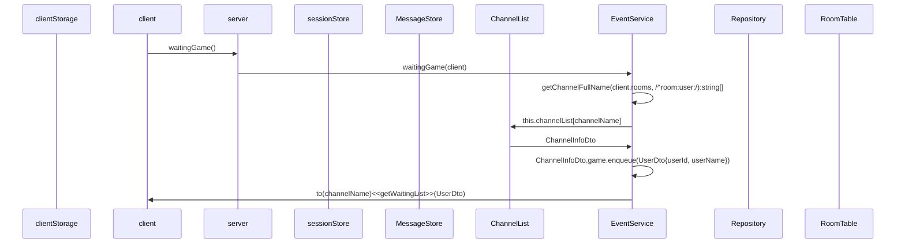
# startGame
- 계속 Queue를 확인하면서 2명인지 체크해야 함.

# readyGame
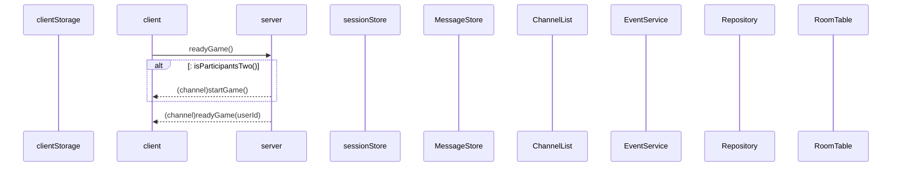
# endGame
- 게임 기록 db에 등록
- matcher 제거
- 대기열 유저 matcher 등록
- 등록된 유저 대기열 삭제
- channel에 게임 종료 emit{matcher, waiter}
  
## gameOver (listen)
```
{matcher:[1234, 45315], waiter:[5234, 34542, 3425342]}
```
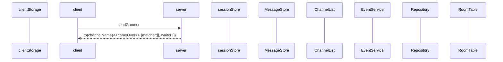
# gameGenerated
- private(target에게 초대 메시지 알림 감), protected(pw있어야 함)
## createChannel (listen)
```
{channelName:"diavlo",  accessLayer: "private", 
  score: 13, adminID: 543}
```
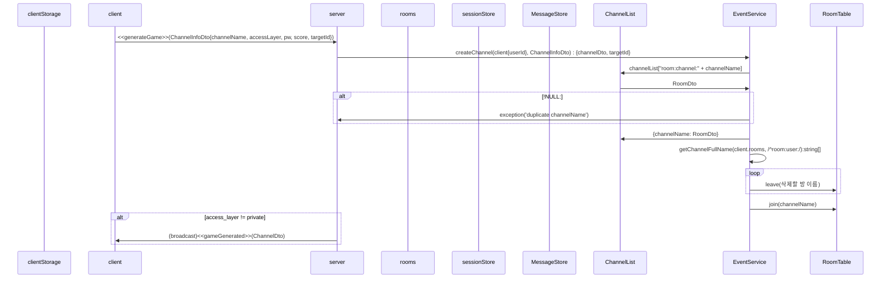