# 모든 소켓 통신
- auth.sessionID 서버 저장소를 뒤지든 랜덤으로 만들고, userID는 안받으면 에러.
- 이 정보들 서버측에서 socket.*로 쓸 수 있게 값 넣어줌 
#- sessionID: (public용)reconnection시 sessionID로 userID(다른 기기로 접속한 mtak들의 소켓이 userID가 이름인 방 안에 계심.) 찾음.(한번 왔던 놈인지 확인)
- userID: (private용)db의 userID와 동일하며, 무슨 sessionID로 접속하더라도 동일한 자기 room(방이름이 "userID")에 접속할 수 있다. 고로
- 여러 내가 sessionID로 동시 접속시 userID방에 내 소켓이 여러개일 수 있다. 
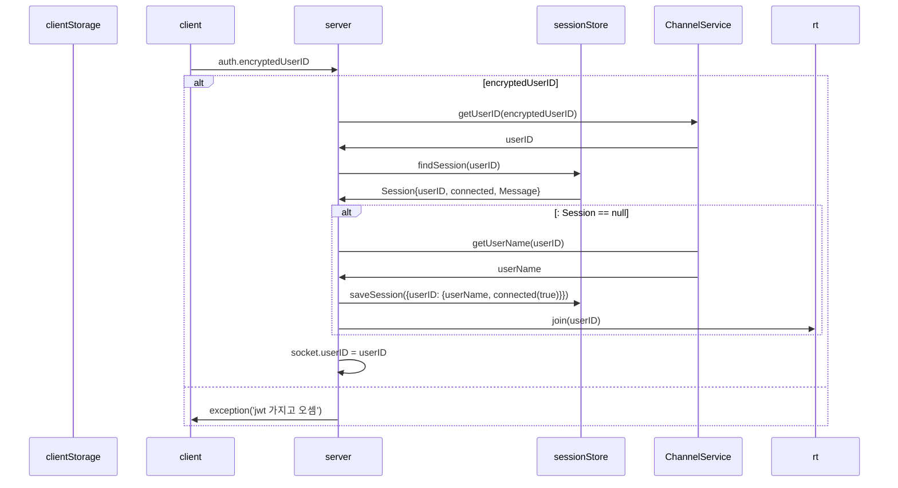

# 소켓 연결 직후
- 영속성을 위해 세션을 저장해준다.
- blockList client로 내려줌
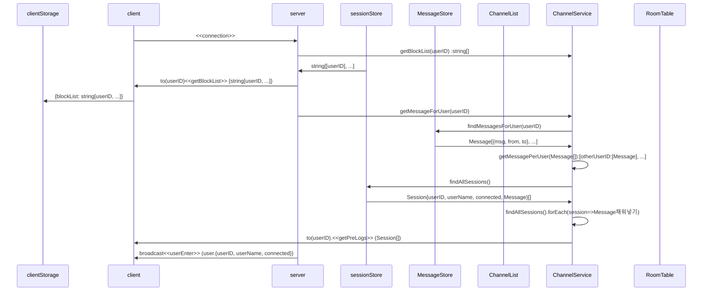

# 소켓 연결 끊겼을 때
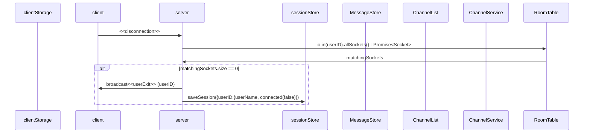

# inChannel
```mermaid
sequenceDiagram
participant cls as clientStorage
participant c as client
participant ga as server
participant r as rooms
participant ss as sessionStore
participant ms as MessageStore
participant cns as ChannelList
participant cs as ChannelService
participant rt as RoomTable

c->>ga: <<inChannel>>(channelName)
cs->>cs: enterChannel(client, channelName) :channelName
cs->>rt: client.rooms.has(channelName)
rt->>cs: bool
alt: false
cs->>cs: getChannelFullName(client.rooms, /^room:user:/):string[]
loop
cs->>rt: leave(삭제할 방 이름)
end
cs->>rt: join(channelName)
cs->>ga: broadcast.except(channelName)<<UserEnteredServer>>{userID, channelName}
cs->>ga: to(channelName)<<getMessage>>(`${userName}님이 ${channelName}에 입장하셨습니다`}
```

# outChannel
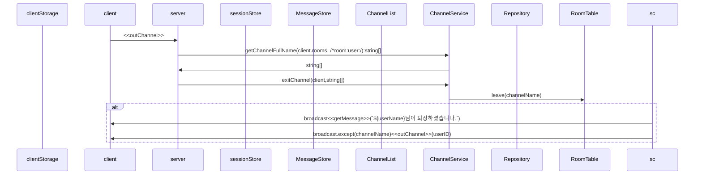

# block
- 상대의 DM을 안받는다. => 모든 DM은 pass된다. 대신 초기 connection에서 DB를 뒤져 blocklist를 local storage로 내려준다. client는 일단 DM을 받고 localStorage를 뒤져서 있으면 뿌려주고 없으면 무시한다.
- unfollow처리한다.
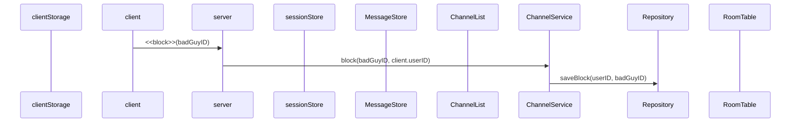
# follow
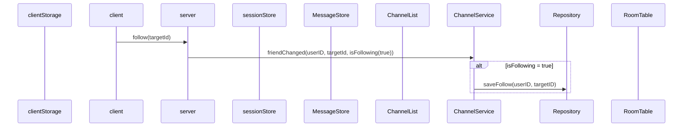
# unfollow
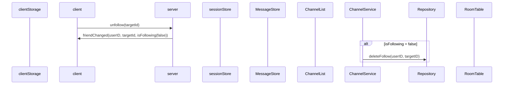

# sendDM
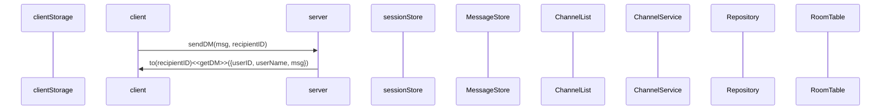

# sendMSG
- channel단위 msg 전송
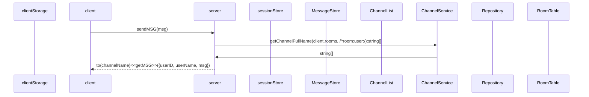

# kickOut

# modifyGame

# inviteUser
- ChannelName은 room:user:[userID]
- 초대 받은 사람은 강제소환됨.
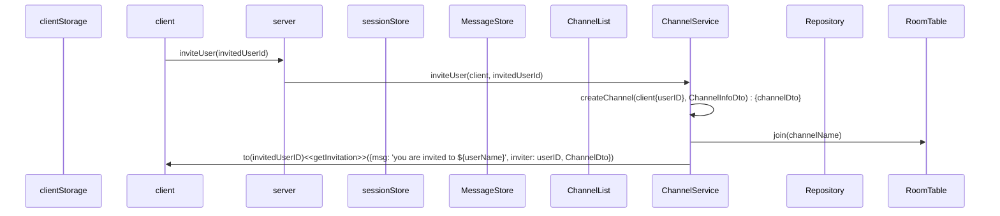

# mute

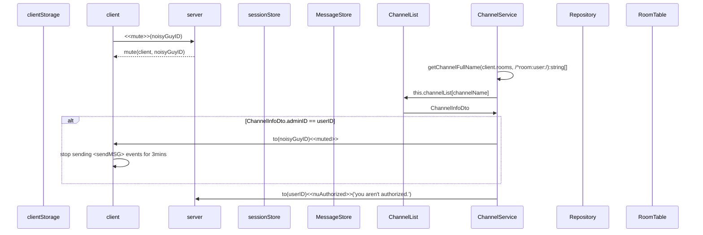
# waitingGame
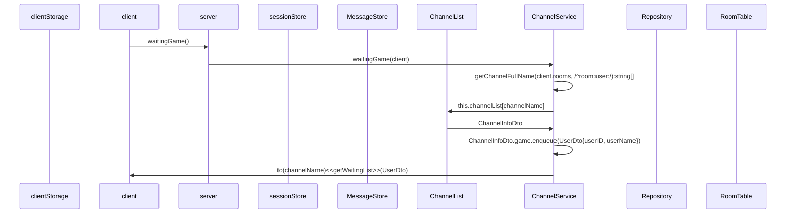
# startGame
- 계속 Queue를 확인하면서 2명인지 체크해야 함.
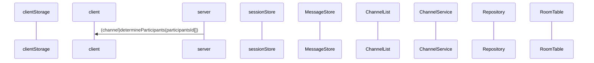
# readyGame
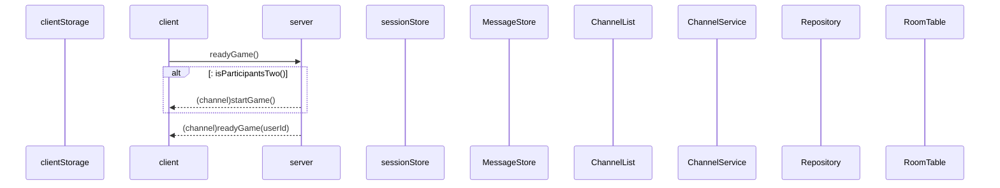
# endGame
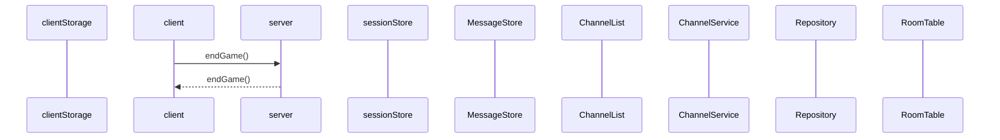
# generateGame
- private(target에게 dm이 감), protected(pw있어야 함)
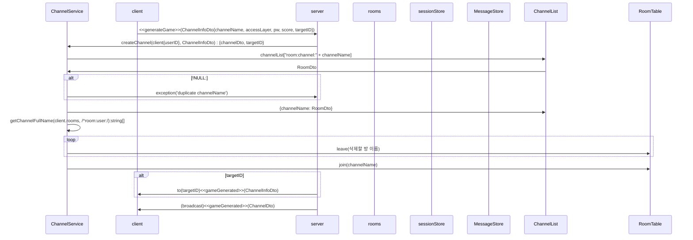