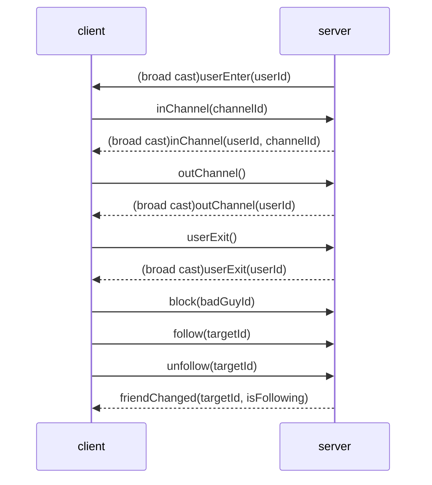
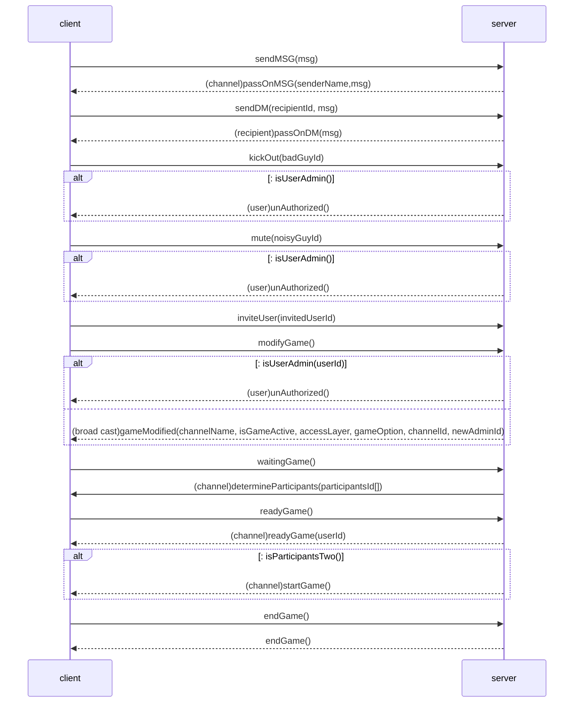
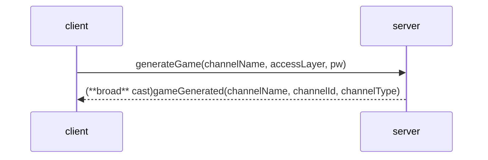

# room:user

```mermaid
sequenceDiagram
participant c as client
participant s as server

s->>c: (broad cast)userEnter(userId)
c->>s: 	inChannel(channelId)
s-->>c: (broad cast)inChannel(userId, channelId)
c->>s: 	outChannel()
s-->>c: (broad cast)outChannel(userId)
c->>s: userExit()
s-->>c: (broad cast)userExit(userId)
c->>s: block(badGuyId)
c->>s: follow(targetId)
c->>s: unfollow(targetId)
s-->>c: friendChanged(targetId, isFollowing)
```

# room:channel:[channelId]

```mermaid
sequenceDiagram
participant c as client
participant s as server

c->>s: sendMSG(msg)
s-->>c: (channel)passOnMSG(senderName,msg)
c->>s: sendDM(recipientId, msg)
s-->>c: (recipient)passOnDM(msg)
c->>s: kickOut(badGuyId)
alt: isUserAdmin()
s-->>c: (user)unAuthorized()
end
c->>s: mute(noisyGuyId)
alt: isUserAdmin()
s-->>c: (user)unAuthorized()
end
c->>s: inviteUser(invitedUserId)
c->>s: modifyGame()
alt: isUserAdmin(userId)
s-->>c: (user)unAuthorized()
else
s-->>c: (broad cast)gameModified(channelName, isGameActive, accessLayer, gameOption, channelId, newAdminId)
end
c->>s: waitingGame()
s->>c: (channel)determineParticipants(participantsId[])
c->>s: readyGame()
s-->>c: (channel)readyGame(userId)
alt: isParticipantsTwo()
s-->>c: (channel)startGame()#toDo:나중에 game 디테일
end
c->>s: endGame()#client가 participant면
s-->>c:endGame()

```

# room:main

```mermaid
sequenceDiagram
participant c as client
participant s as server

c->>s: generateGame(channelName, accessLayer, pw)
s-->>c: (**broad** cast)gameGenerated(channelName, channelId, channelType)

```
